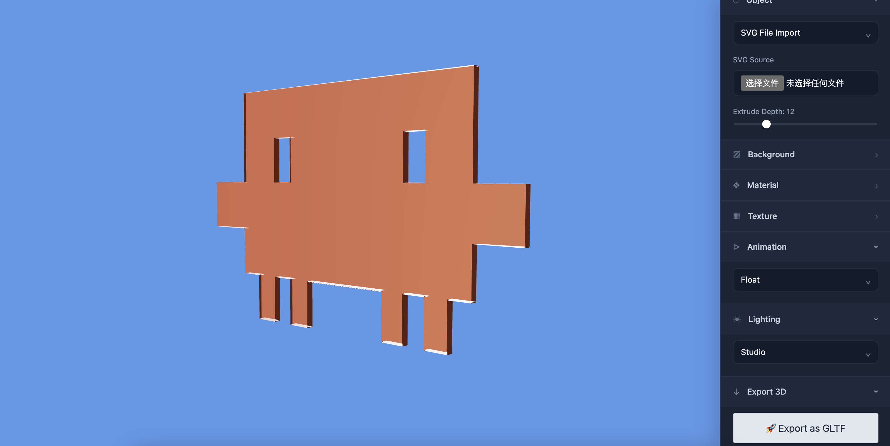

# Vectra 3D

Vectra 3D instantly transforms 2D designs into the third dimension. Upload SVG vectors, raster images, or input text to generate 3D models with realistic physical materials directly in your browser.

The system features a high-performance image tracing engine that accurately extracts contours for automatic extrusion modeling. Powered by Three.js real-time rendering, you can switch between metallic, high-definition glass, or gold materials while precisely controlling depth and environmental lighting. Complex modeling workflows are condensed into an intuitive interactive experience, supporting one-click exports in GLTF or OBJ formats. This open-source tool streamlines UI scene presentation and dynamic logo creation, bringing 2D creativity to life in 3D space.

## Core Features

- **Multi-Format Conversion**: Support for SVGs, common raster formats (PNG/JPG), and custom text-to-3D.
- **Dynamic Material System**: Built-in presets for Metal, Glass, and Gold with color override support.
- **Real-time Animation**: Integrated floating, spinning, and pulsing effects for dynamic displays.
- **Professional Lighting**: Toggle between Studio, Outdoor, and Dramatic lighting environments.
- **Production-Ready Export**: Fully balanced GLTF and OBJ export functionality.

## Tech Stack

- **Core**: React 19 + TypeScript
- **Rendering**: Three.js + React Three Fiber
- **Vector Engine**: ImageTracer.js (Custom Integration)
- **UI**: Vanilla CSS (Premium Glassmorphism Design)

---

Enjoy creating 3D masterpieces with Vectra 3D!
